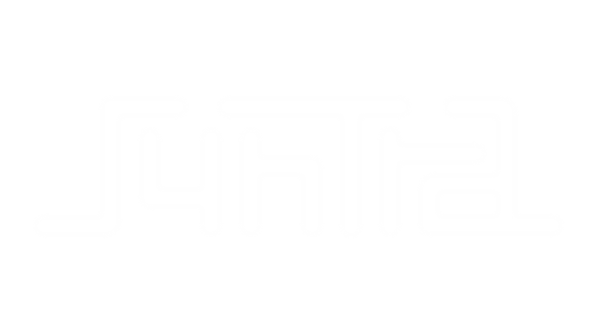

# Syntra Engine



Syntra Engine is a lightweight, User Friendly, Beta (Work in progress) 3D game engine built with OpenGL. It’s designed to be optimized, modular, and easy to integrate into custom projects.

Goals:

- An Engine Built for my horror/shooter games, a very basic. TODO in sample/sample.cpp

## Manual Build

**Required Libraries**
Before building, ensure the following libraries are statically built and placed in the `libs/` folder for your platform (`.so`, `.dll`, `.a`)

### Mac OS

**1.** Install `clang ninja cmake` by brew:

```bash
brew install gcc clang make cmake
```

**2.** Build Project:

```bash
cd Syngine/
cmake .
```

### Linux

**1.** Install clang, cmake, and ninja using your distro's package manager.
**2.** Build Project:

```bash
cd Syngine/
cmake .
```

### Windows (MSYS2 + MinGW Only)

> **NOTE:** MSVC (Visual Studio) is not supported due to cross-platform concerns. Please use MSYS2 with MinGW/Clang toolchain.

**1.** Install MSYS2: <https://www.msys2.org/>
**2.** Ensure all of (clang ninja cmake) packages are installed:

```bash
# Update MSYS2 package database and core system packages first (using mingw environment)
pacman -Syu
pacman -S mingw-w64-x86_64-clang mingw-w64-x86_64-ninja mingw-w64-x86_64-cmake

cmake --version
clang --version
gcc --version
```

> If you get errors or command not found, it means you've failed the installation (part 2) or your environment variables are not set.
> Set MSYS binaries to your Windows Path (By default MSYS installed at C:\msys64. replace it with your installation as exception):

```bash
C:\msys64\clang64\bin
C:\msys64\mingw64\bin
C:\msys64\mingw32\bin
C:\msys64\ucrt64\bin
C:\msys64\usr\bin
```

**3.** Build Project:

```bash
cmake --preset=clang
cmake --build --preset=build-clang
```
