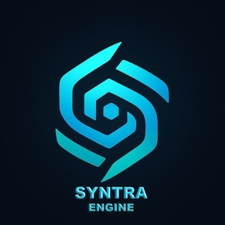
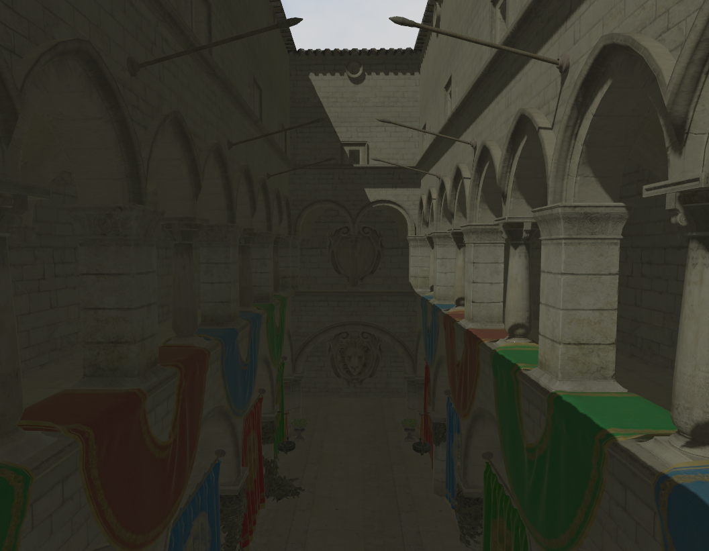

# Syntra Engine



Syntra Engine is a modular, cross-platform Indie game engine, Beta (Work in progress) 3D/2D game engine built using OpenGL.

Currently supported platforms:
- Windows x86_64
- Unix/Unix-like Operating Systems (Linux, Mac, BSD, etc.)
- WebAssembly (WebGL 2)

Todo:
- Android (NDK)

## Sponza


## Manual Build

**Required Libraries**
Before building, ensure the following libraries are statically built and placed in the `libs/` folder for your platform (`.so`, `.dll`, `.a`)

### Mac OS

**1.** Install `clang ninja cmake` by brew:

```bash
brew install gcc clang make cmake
```

**2.** Build Project:

```bash
cd Syngine/
cmake .
```

### Linux

**1.** Install clang, cmake, and ninja using your distro's package manager.
**2.** Build Project:

```bash
cd Syngine/
cmake .
```

### Windows (MSYS2 + MinGW Only)

> **NOTE:** MSVC (Visual Studio) is not supported due to cross-platform concerns. Please use MSYS2 with MinGW/Clang toolchain.

**1.** Install MSYS2: <https://www.msys2.org/>
**2.** Ensure all of (clang ninja cmake) packages are installed:

```bash
# Update MSYS2 package database and core system packages first (using mingw environment)
pacman -Syu
pacman -S mingw-w64-x86_64-clang mingw-w64-x86_64-ninja mingw-w64-x86_64-cmake

cmake --version
clang --version
gcc --version
```

If you get errors or command not found, it means you've failed the installation (part 2) or your environment variables are not set.
Set MSYS binaries to your Windows Path (By default MSYS installed at C:\msys64. replace it with your installation as exception):

```bash
C:\msys64\clang64\bin
C:\msys64\mingw64\bin
C:\msys64\mingw32\bin
C:\msys64\ucrt64\bin
C:\msys64\usr\bin
```

**3.** Build Project:

```bash
cmake --preset=clang
cmake --build --preset=build-clang
```

### Web Build (Emscripten)
Before building you have to install emsdk based on your platform. Just install emsdk in unix path/standards, in linux, Mac or any unix-styled or unix-based operating systems, all you have to do is just using the system's terminal/shell, but in windows, everything is an exception, and windows literally forces you to use their own super-exceptional path system that is against every unix system. Thanks to MSYS2 + MINGW64 universal building system is far easier. so unlike other operating systems, in windows you have to use MSYS2 (MINGW64) terminal in order to setup and install emsdk:

> **NOTE:** Do not install emsdk using emsdk.bat or windows standards, otherwise you'll very likely getting build errors, as emsdk tries to use windows-relative paths, and at the same time, cmake/clang/ninja tries to use unix-like paths.

> **NOTE:** In Windows, you have to install latest python3 package under MSYS2 (MINGW64) Subsystem:
```bash
pacman -Syu
pacman -S mingw-w64-x86_64-python
```

Using unix-based commands:
```bash
# Clone emsdk from repository
git clone https://github.com/emscripten-core/emsdk.git

# Enter that directory
cd emsdk

# Fetch the latest version of the emsdk (not needed the first time you clone)
git pull

# Download and install the latest SDK tools.
./emsdk install latest

# Make the "latest" SDK "active" for the current user. (writes .emscripten file)
./emsdk activate latest
```

For Non-Windows operating systems, you can only add that line in your .bash_profile or any shell startup profile:
```bash
# Activate PATH and other environment variables in the current terminal
source ./emsdk_env.sh
```

For Windows however, you need to add that directory to the environment variables -> Path:
```bash
<Your Emsdk directory>\upstream\emscripten
```

Use `emcmake.bat` instead of `emcmake` in windows, if you get "Unknown command" errors.

**3.** Build Project:

```bash
mkdir out/build/testweb
cd out/build/testweb
emcmake cmake ../../..  -DWEB=ON
cmake --build .
```